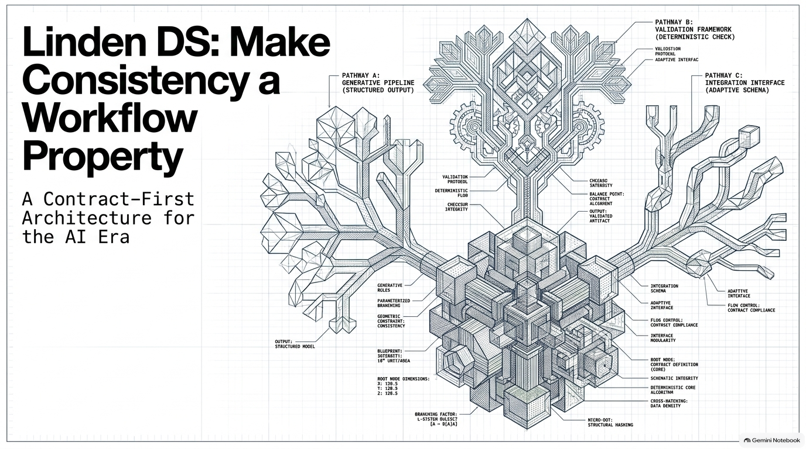

# Linden Design System

**A contract-driven design system for keeping design, engineering, documentation, tooling, and AI aligned.**

We are building Linden around a simple idea: a design system should have one reviewed definition of what each capability means. Figma and code express that definition; neither owns it.



## The Problem

Design systems live in many places: Figma libraries, application code, tokens, documentation, Storybook, accessibility guidance, and platform-specific implementations. Over time, each representation can become its own source of truth.

That creates drift:

- a variant exists in Figma but not in code;
- an implementation supports behavior the documentation does not explain;
- teams rebuild the same pattern with different names or rules;
- AI generates plausible-looking UI that is not actually part of the system.

The same capability can then mean something different in design, code, documentation, and each platform.

## The Vision

Linden makes a canonical, typed, machine-readable contract the **single semantic source of truth**. The contract describes the capabilities the system supports: structure, options, behavior, accessibility requirements, guidance, and relationships.

Everything else either:

1. derives from the contract;
2. implements the contract in a platform-native way; or
3. is validated against the contract.

This separates **what the system permits** from **how a particular tool or platform implements it**.

## Why The Contract Is The Source Of Truth

Figma is optimized for designing and exploring experiences. Code is optimized for running them. Documentation is optimized for explaining them. Each is essential, but none can carry the shared meaning for every platform and consumer.

The contract is the stable interface between design, engineering, documentation, tooling, and AI. It keeps the meaning consistent without forcing every platform to share the same implementation.

The contract is not a Figma serialization, a replacement for engineering architecture, or a dump of every implementation detail. It defines the supported interface and invariant behavior; each platform remains free to realize that capability idiomatically.

## How Linden Works

**Reviewed contract → generated views or platform-native implementations → independent validation**

1. **Define:** humans review a platform-neutral capability contract.
2. **Project or implement:** generators and platform tooling translate that contract into the representations each consumer needs.
3. **Validate:** independent checks compare generated or implemented outputs with the approved contract and report drift.
4. **Evolve:** ideas may begin in design, code, product needs, or AI-assisted exploration, but they become canonical only after review updates the contract.

## Architecture At A Glance

| Layer | Responsibility |
| --- | --- |
| Contracts | Define approved capabilities, constraints, guidance, and relationships. |
| Shared generators and platform tooling | Translate contract meaning for a particular consumer or platform. |
| Implementations | Realize the capability in Figma, React, or another native environment. |
| Views and tools | Generated documentation and Storybook expose approved knowledge to humans and agents; future interfaces can consume the same shared fields. |
| Independent validation | Detect drift without becoming another source of truth. |

## The Public Pilot

This repository demonstrates the core architecture with foundation contracts, deterministic generators, a Button capability, Storybook examples, and independent validation. It is a focused pilot, not a claim that every platform or production publishing workflow is complete.

## Explore The Pilot

```sh
pnpm install --frozen-lockfile
pnpm run validate
```

- `pnpm install --frozen-lockfile` installs the exact dependency versions recorded in `pnpm-lock.yaml`. It stops if the package manifest and lockfile disagree instead of silently changing the dependency graph.
- `pnpm run validate` runs the public release checks: TypeScript type checking, contract tests, generated-artifact parity, runtime and accessibility tests, and a production Storybook build.

## Public Boundary

This public repository excludes private Figma operations, signed evidence, workflow metadata, personal identity metadata, and portfolio materials.

## License

Original code and documentation are licensed under Apache-2.0. Bundled Geist font files remain under the SIL Open Font License in `foundations/assets/fonts/geist/1.7.2/OFL.txt`.
